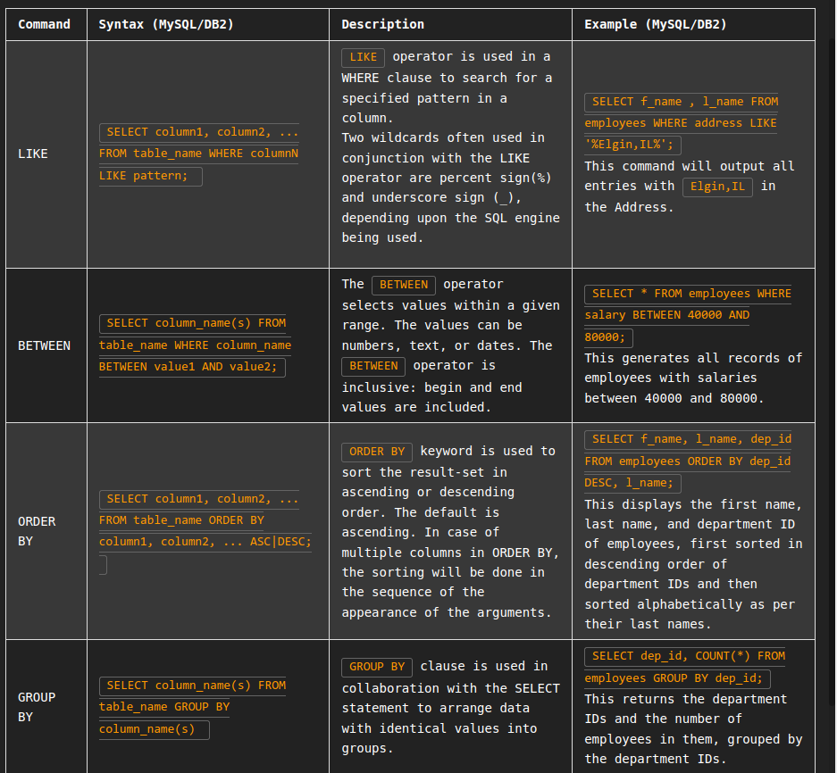
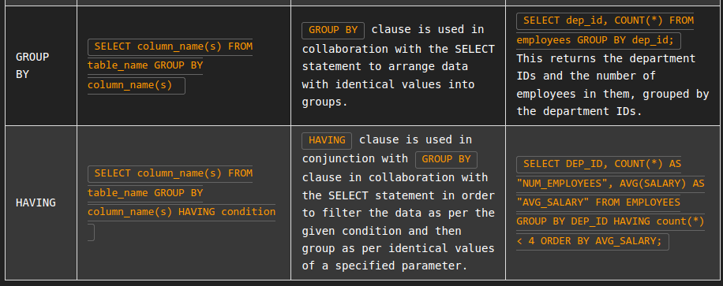
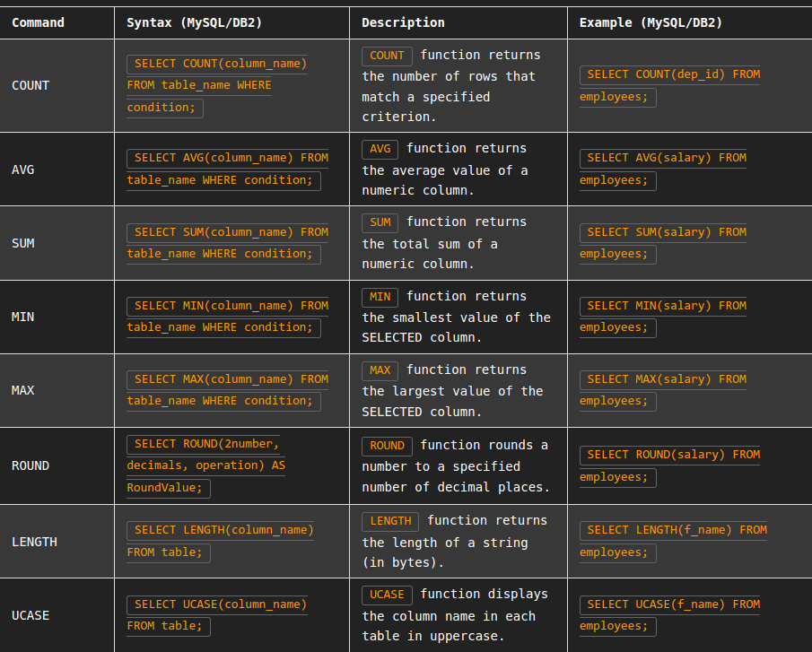
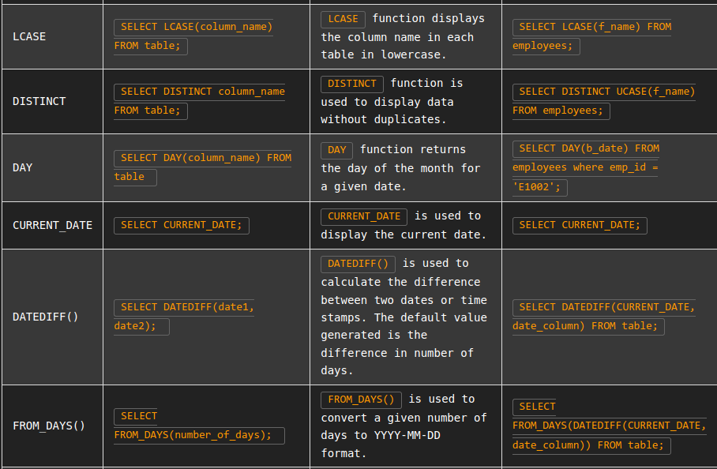
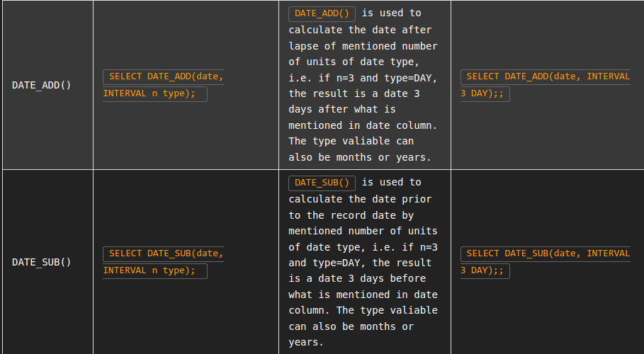
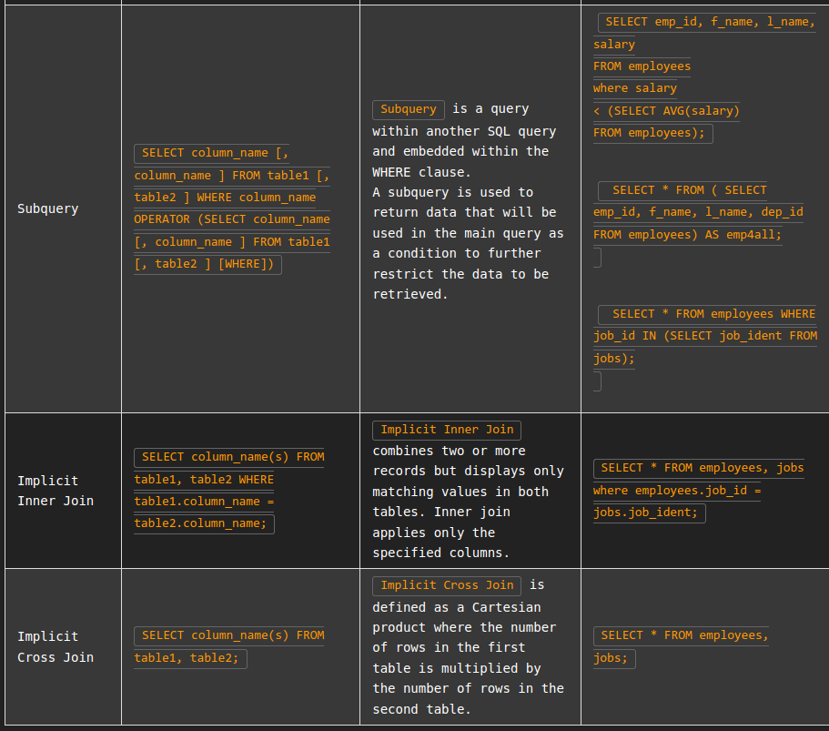

# String Patterns

You can use string patterns to filter the response of a query. Let's look at the following example:

Say you need to retrieve the first names F_NAME and last names L_NAME of all employees who live in Elgin, IL. You can use the LIKE operator to retrieve strings that contain the said text. The code will look as shown below.

SELECT F_NAME, L_NAME
FROM EMPLOYEES
WHERE ADDRESS LIKE '%Elgin,IL%';

Now assume that you want to identify the employees who were born during the 70s. The query above can be modified to:

SELECT F_NAME, L_NAME
FROM EMPLOYEES
WHERE B_DATE LIKE '197%';

Note that in the first example, % sign is used both before and after the required text. This is to indicate, that the address string can have more characters, both before and after, the required text.

In the second example, since the date of birth in Eployees records starts with the birth year, the % sign is applied after 197%, indicating that the birth year can be anything between 1970 to 1979. Further the % sign also allows any possible date throughout the selected years.

Consider a more specific example. Let us retrieve all employee records in department 5 where salary is between 60000 and 70000. The query that will be used is:

SELECT *
FROM EMPLOYEES
WHERE (SALARY BETWEEN 60000 AND 70000) AND DEP_ID = 5;

# SOrting

You can sort the retrieved entries on the basis of one or more parameters.

First, assume that you have to retrieve a list of employees ordered by department ID.

Sorting is done using the ORDER BY clause in your SQL query. By default, the ORDER BY clause sorts the records in ascending order.

SELECT F_NAME, L_NAME, DEP_ID 
FROM EMPLOYEES
ORDER BY DEP_ID;

Now, get the output of the same query in descending order of department ID, and within each deaprtment, the records should be ordered in descending alphabetical order by last name. For descending order, you can make use of the DESC clause.

SELECT F_NAME, L_NAME, DEP_ID 
FROM EMPLOYEES
ORDER BY DEP_ID DESC, L_NAME DESC;

# Grouping
    NOTE: The SQL problems in this exercise involve usage of SQL Aggregate functions AVG and COUNT. COUNT has been covered earlier. AVG is a function that can be used to calculate the Average or Mean of all values of a specified column in the result set. For example, to retrieve the average salary for all employees in the EMPLOYEES table, issue the query: SELECT AVG(SALARY) FROM EMPLOYEES;.

    A good example of grouping would be if For each department ID, we wish to retrieve the number of employees in the department.

    SELECT DEP_ID, COUNT(*)
FROM EMPLOYEES
GROUP BY DEP_ID;

You can refine your outut by using appropriate labels for the columns of data retrieved. Label the computed columns in the result set of the last problem as NUM_EMPLOYEES and AVG_SALARY.

SELECT DEP_ID, COUNT(*) AS "NUM_EMPLOYEES", AVG(SALARY) AS "AVG_SALARY"
FROM EMPLOYEES
GROUP BY DEP_ID;

You can also combine the usage of GROUP BY and ORDER BY statements to sort the output of each group in accordance with a specific parameter. It is important to note that in such a case, ORDER BY clause muct be used after the GROUP BY clause. For example, we can sort the result of the previous query by average salary. The SQL query would thus become

SELECT DEP_ID, COUNT(*) AS "NUM_EMPLOYEES", AVG(SALARY) AS "AVG_SALARY"
FROM EMPLOYEES
GROUP BY DEP_ID
ORDER BY AVG_SALARY;

In case you need to filter a grouped response, you have to use the HAVING clause. In the previous example, if we wish to limit the result to departments with fewer than 4 employees, We will have to use HAVING after the GROUP BY, and use the count() function in the HAVING clause instead of the column label.

SELECT DEP_ID, COUNT(*) AS "NUM_EMPLOYEES", AVG(SALARY) AS "AVG_SALARY"
FROM EMPLOYEES
GROUP BY DEP_ID
HAVING count(*) < 4
ORDER BY AVG_SALARY;

# SQL Cheat Sheet: Intermediate - LIKE, ORDER BY, GROUP BY

# Built in DataFunctions

## objecetive
- Most databases caome with built in SQL functions.
- These functions can be includued as part of SQL statements.
- Database functions can significantly reduce the amount of data that needs to be retrieved.
- Can speed up data processing.

# Aggregate Functions
 Aggregate functions are used to calculate a single value from a set of values.
 List are:
 - AVG()
 - SUM()
 - MIN()
 - MAX()

## Examples

1. Write a query that calculates the total cost of all animal rescues in the PETRESCUE table.
   - SELECT SUM(COST) FROM PETRESCUE;

2. Write a query that displays the maximum quantity of animals rescued (of any kind).
    - SELECT MAX(QUANTITY) FROM PETRESCUE;
    - SELECT MIN(QUANTITY) FROM PETRESCUE; ( if minimum is asked)
3. Write a query that displays the average cost of animals rescued.
    - SELECT AVG(COST) FROM PETRESCUE;
  
  ## Scalar Functions
  This built in function used in for string or varchar and a s well to numbers to determine and retrive the data based on predefined predective.
  List are:
  - UCASE()
  - LCASE()
  - ROUND()
  - LENGTH()
## Examples
1. Write a query that displays the rounded integral cost of each rescue.
    - SELECT ROUND(COST) FROM PETRESCUE;
  - The query could also be written as: SELECT ROUND(COST, 0) FROM PETRESCUE;

2. Write a query that displays the length of each animal name.
   - SELECT LENGTH(ANIMAL_NAME) FROM PETRESCUE;
  
3. Write a query that displays the animal name in each rescue in uppercase.
    - SELECT UCASE(ANIMAL) FROM PETRESCUE;

# Date And Time Functions

Most databaes contain special datatypes for dates and times

- Date : YYYYMMDD (8 digit)
- Time : HHMMSS (6 digigt)
- Timestamp : YYYYXXDDHHMMSSZZZZZZ (20 digit), x represnts month and z represent micro seconds
  
  Functions:
  - YEAR()
  - MONTH()
  - DAY()
  - DAYOFMONTH()
  - DAYOFWEEK()
  - DAYOFYEAR()
  - WEEK()
  - HOUR()
  - MINUTE()
  - SECOND()
  

  ## Examples

1. Write a query that displays the rescue date.
   `    - SELECT DAY(RESCUEDATE) FROM PETRESCUE;

2. Animals rescued should see the vet within three days of arrival. Write a query that displays the third day of each rescue.
    - SELECT DATE_ADD(RESCUEDATE, INTERVAL 3 DAY) FROM PETRESCUE
    - SELECT DATE_ADD(RESCUEDATE, INTERVAL 2 MONTH) FROM PETRESCUE ( if 2 moonth)
    - SELECT DATE_SUB(RESCUEDATE, INTERVAL 3 DAY) FROM PETRESCUE ( if before rescure 3 day)
  
3. Write a query that displays the length of time the animals have been rescued, for example, the difference between the current date and the rescue date.
    - SELECT DATEDIFF(NOW(), RESCUEDATE) FROM PETRESCUE;
    - SELECT DATEDIFF(CURRENT_DATE, RESCUEDATE) FROM PETRESCUE
    - SELECT FROM_DAYS(DATEDIFF(CURRENT_DATE, RESCUEDATE)) FROM PETRESCUE ( if output is required in yyyy-mm-dd format)

# SUB Queries and Nested Selects

## Objective
- covers the limitations of aggregate functions
- compose sub-queries in the where clause
- build column expression and write table expression ( substitute sub query in place of column and a table)
  

 Say you are asked to retrieve all employee records whose salary is lower than the average salary. You might use the following query to do this.
    
    - SELECT * FROM EMPLOYEES WHERE salary < AVG(salary);

However, this query will generate an error stating, "Illegal use of group function." Here, the group function is AVG and cannot be used directly in the condition since it has not been retrieved from the data. Therefore, the condition will use a sub-query to retrieve the average salary information to compare the existing salary. The modified query would become:

    - SELECT * FROM EMPLOYEES WHERE SALARY < (SELECT AVG(SALARY)  FROM EMPLOYEES);
  
Now, consider executing a query that retrieves all employee records with EMP_ID, SALARY, and maximum salary as MAX_SALARY in every row. For this, the maximum salary must be queried and used as one of the columns. This can be done using the query below.

    - SELECT EMP_ID, SALARY, (SELECT MAX(SALARY) FROM EMPLOYEES) AS MAX_SALARY FROM EMPLOYEES;

Now, consider that you wish to extract the first and last names of the oldest employee. Since the oldest employee will be the one with the smallest date of birth, the query can be written as:

    - SELECT F_NAME, L_NAME FROM EMPLOYEES WHERE B_DATE =(SELECT MIN(B_DATE) FROM EMPLOYEES);

You may also use sub-queries to create derived tables, which can then be used to query specific information. Say you want to know the average salary of the top 5 earners in the company. You will first have to extract a table of the top five salaries as a table. From that table, you can query the average value of the salary. The query can be written as follows.

        - SELECT AVG(SALARY) FROM (SELECT SALARY 
      FROM EMPLOYEES 
      ORDER BY SALARY DESC 
      LIMIT 5) AS SALARY_TABLE;

Note that it is necessary to give an alias to any derived tables.

# Working with multiple Tables

1. Accessing multiple tables using sub-queries
   
   - retrieve only the EMPLOYEES records corresponding to jobs in the JOBS table.
        - SELECT * FROM EMPLOYEES WHERE JOB_ID IN (SELECT JOB_IDENT FROM JOBS);
  
   - Retrieve JOB information for employees earning over $70,000.
      - SELECT JOB_TITLE, MIN_SALARY, MAX_SALARY, JOB_IDENT FROM JOBS WHERE JOB_IDENT IN (select JOB_ID from EMPLOYEES where SALARY > 70000 );
  

  
2. Accessing multiple tables using Implicit Join 
    - Retrieve only the EMPLOYEES records corresponding to jobs in the JOBS table.
      - SELECT * FROM EMPLOYEES, JOBS WHERE EMPLOYEES.JOB_ID = JOBS.JOB_IDENT;
  
    - Redo the previous query using shorter aliases for table names.
       - SELECT * FROM EMPLOYEES E, JOBS J WHERE E.JOB_ID = J.JOB_IDENT;

# SQL Cheat Sheet: FUNCTIONS and Implicit JOIN

